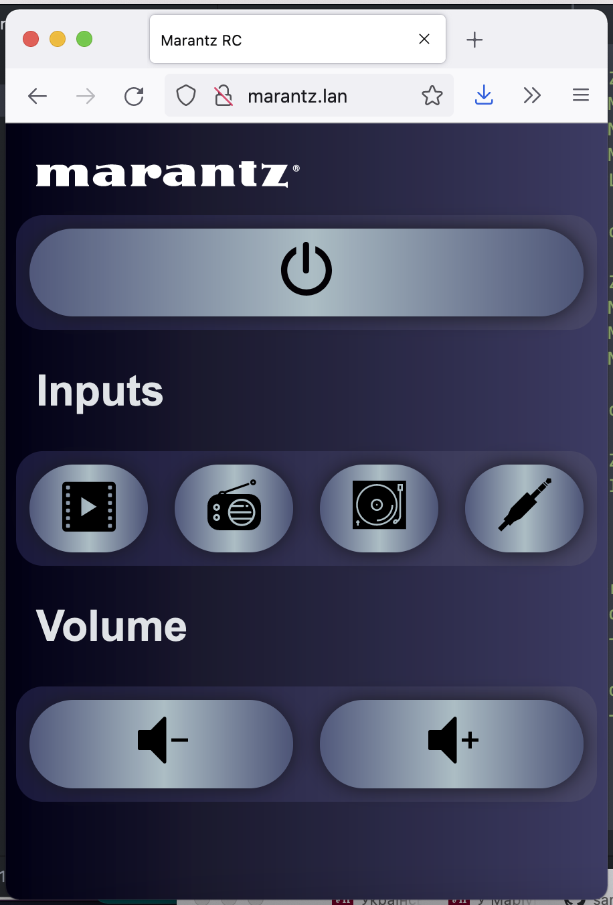

# Marantz ESP8266 based remote control with mDNS. Codes for "optical" and "network" remote buttons on newer amplfiifers

Web based remote control for Matantz amplifier using ESP8266.

## About

This project implements web interface usable from mobile/tablet/desktop for PM series of Marantz amplifiers but likely will work with any?.
It is using "Remote IN" socket and ESP8266 GPIO output.
I had to connect it via diode (i used **1N5408** but +- any should work) to avoid current from amplifier to the board when infrared RC is used.

You can find more about Marantz remote socket and wire protocol in this [blog post](https://smallhacks.wordpress.com/2021/07/07/controlling-marantz-amplifier-using-arduino-via-remote-socket/).

## Some implementation notes

Project is using [ESPAsyncWebServer](https://github.com/me-no-dev/ESPAsyncWebServer)
to provide HTTP and implements 2 endpoints: `/` to output HTML web page (with all embedded images and simple js) and `/update?button=<id>` which allows to send commands to the device. Supported ID-s are "standby, phono, cd, tuner, optical, network, dcc, tape, volume_up, volume_down". All SVG icons are embedded to the source code, you can use SPIFFS if you prefer them to be served as files.

HTML source could be found in the [html.h](html.h) header, it is using some rudimentary scripting (e.g. `onclick` instead of DOM listeners) to be compatible with my older iPad. Protocol is one-way, so its not possible to grab device status. HTTP was choosen as it is compatible with any web browser.

## Screenshot

